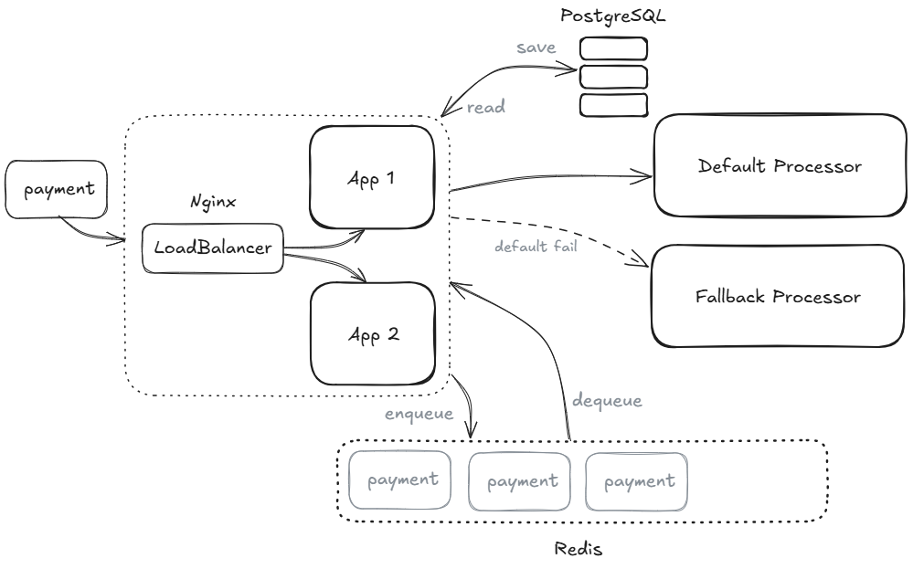
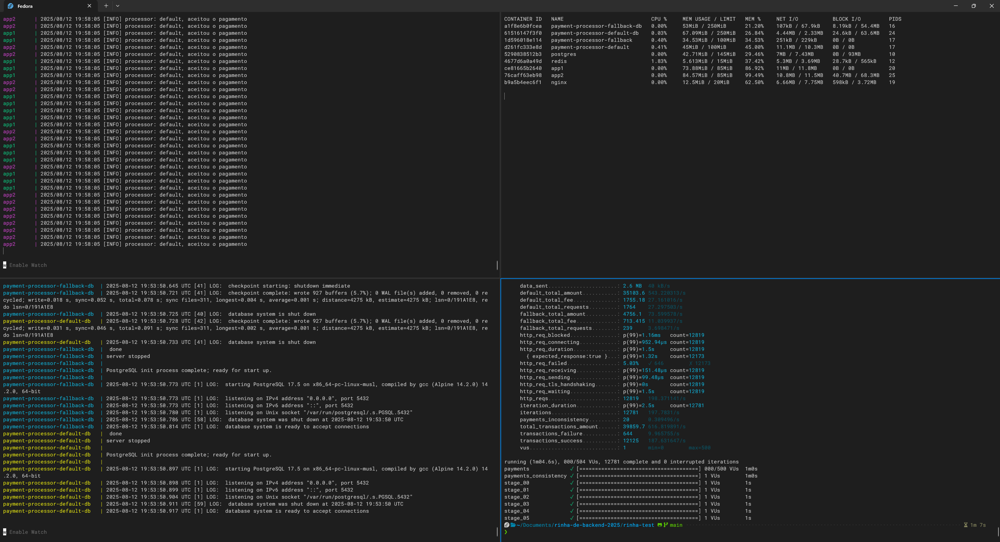

# Rinha de Backend 2025 - Minha Submissão

Este repositório é a minha [submissão](https://github.com/zanfranceschi/rinha-de-backend-2025/tree/main/participantes/brecabral-go) para o desafio da [Rinha de Backend 2025](https://github.com/zanfranceschi/rinha-de-backend-2025).

## Objetivo

A **Rinha de Backend 2025** é um desafio que consiste em:

- Desenvolver um serviço para intermediar solicitações de pagamentos;
- Possuir no mínimo duas instâncias rodando em containers Docker;
- Restringir o hardware com um máximo de `1.5 CPU` e `350 MB` distribuídos entre todos os serviços usados;
- Processar os pagamentos usando um entre dois processadores (`default` e `fallback`);
- Manter um sumário dos pagamentos processados consistente durante todo o teste;
- Processar o máximo de pagamentos no menor tempo e com a menor taxa.

## Arquitetura e Tecnologias

Esta solução implementa um sistema assíncrono de processamento de pagamentos.  
As requisições são enfileiradas e processadas por _workers_ de forma concorrente, priorizando sempre o processador `default` e utilizando o `fallback` em caso de falhas `5xx`.  
Caso ambos os processadores falhem, a transação retorna à fila; falhas de outros tipos descartam a transação.  
Transações bem-sucedidas são armazenadas e utilizadas para gerar o sumário acessível via `/payments-summary`.

- **Go** — Backend com as regras de negócio.
- **PostgreSQL** — Banco de dados para persistência das transações.
- **Redis** — Mensageria para enfileiramento de requisições.
- **Nginx** — Proxy reverso com balanceamento de carga e roteamento.

### Fluxo de Processamento

1. Requisição recebida e enfileirada no Redis.
2. _Worker_ consome a fila e tenta o `default processor`.
3. Falha `5xx` → tenta `fallback processor`.
4. Nova falha `5xx` → transação retorna à fila.
5. Outro tipo de falha → transação descartada.
6. Transações com retorno `2xx` são persistidas.
7. Requisição de sumário retorna as transações persistidas.

## Resultado do Teste Local com K6

